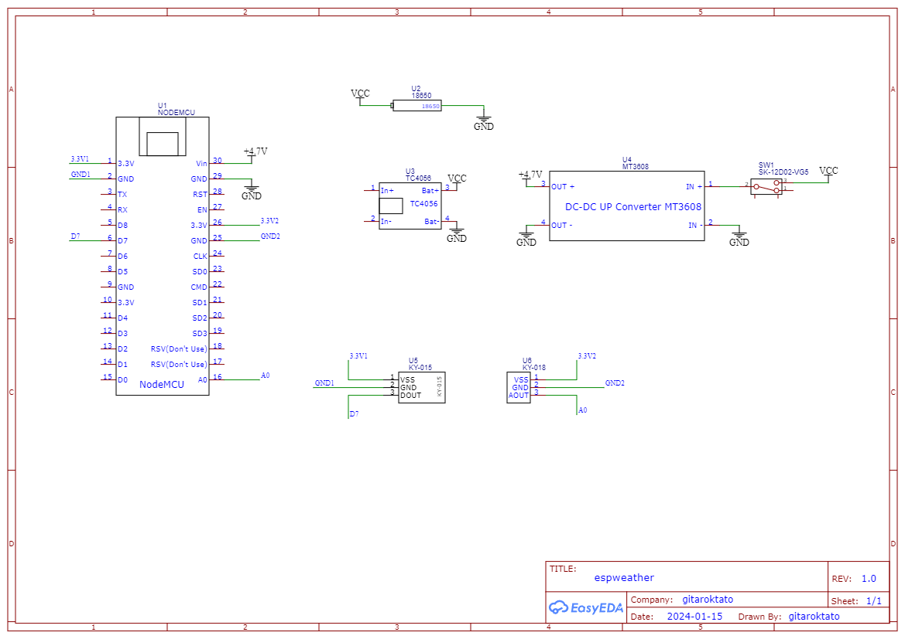

# An ESP8266 -based Weather Station

## Realtime Measurements

## Schematic

## Look & Feel

## Energy Consumption and Battery Life
Powered by a [18650 battery with the capacity of 3300mAh](https://www.hestore.hu/prod_10039174.html?lang=en).

| State | Consumption | Period |
| -- | -- | -- |
| Wake - with onboard LEDs ON | 100mA | ~1s |
| Sleep - with onboard LEDs ON | 30mA | ~1s |
| Wake - with onboard LEDs OFF | 80mA | ~8s |
| Deep Sleep - with onboard LEDs OFF | 10mA | ~10 min |

On average expected reporting time should be **13 days (3300mAh / ~10mA / 24h)**.

- Current reporting time without deep sleep and both LEDs blinking ~22 hrs
- Current reporting time with deep sleep ~3 days (on balcony, but suspecting continuous connection problems. See issue #12)

## Measurements
Measurements made using an oscilloscope through a shunt resistor of 1 Ohm. See the setup below:

Wake - with onboard LEDs ON shows 60mA usage on average.

Deep sleep with periodic wake times - shows 10mA usage on average with 80mA peak. See the table above with estimated battery life.

## References

- https://randomnerdtutorials.com/esp8266-pinout-reference-gpios/
- https://newbiely.com/tutorials/esp8266/esp8266-dht11
- https://arduinomodules.info/ky-015-temperature-humidity-sensor-module/
- https://nothans.com/thingspeak-tutorials/esp8266/building-the-internet-of-things-with-the-esp8266-wi-fi-module-and-thingspeak
- https://github.com/nothans/thingspeak-esp-examples/blob/master/examples/RSSI_to_ThingSpeak.ino

### 3D Designs
- https://www.thingiverse.com/thing:144665
- https://www.thingiverse.com/thing:4805867
- https://www.thingiverse.com/thing:1718334
- https://www.thingiverse.com/thing:1985125

### Powering ESP8266
- https://hackaday.io/project/167731-testing-cheap-linear-li-ion-chargers-for-solar
- https://forum.arduino.cc/t/how-to-power-esp8266-ch304-with-18650-li-ion-battery/1179338/14
- https://randomnerdtutorials.com/esp8266-voltage-regulator-lipo-and-li-ion-batteries/
- https://randomnerdtutorials.com/power-esp32-esp8266-solar-panels-battery-level-monitoring/
- https://www.youtube.com/watch?v=f2yMs-JAyQM
- https://www.youtube.com/watch?v=ttyKZnVzic4
- https://youtu.be/6DY767kQnUM?si=SXygTiLH4zx0RgAH

### Power Consumption Comparison
- https://blog.voneicken.com/2018/lp-wifi-esp-comparison/

### Deep Sleep
- https://randomnerdtutorials.com/esp8266-deep-sleep-with-arduino-ide/
- https://www.instructables.com/ESP8266-Pro-Tips
- https://arduinodiy.wordpress.com/2020/01/18/very-deepsleep-and-energy-saving-on-esp8266/

### Photocells
- https://www.mouser.com/datasheet/2/737/photocells-932884.pdf

### FTDI Upload
https://community.platformio.org/t/esp32-pio-unified-debugger/4541/19
