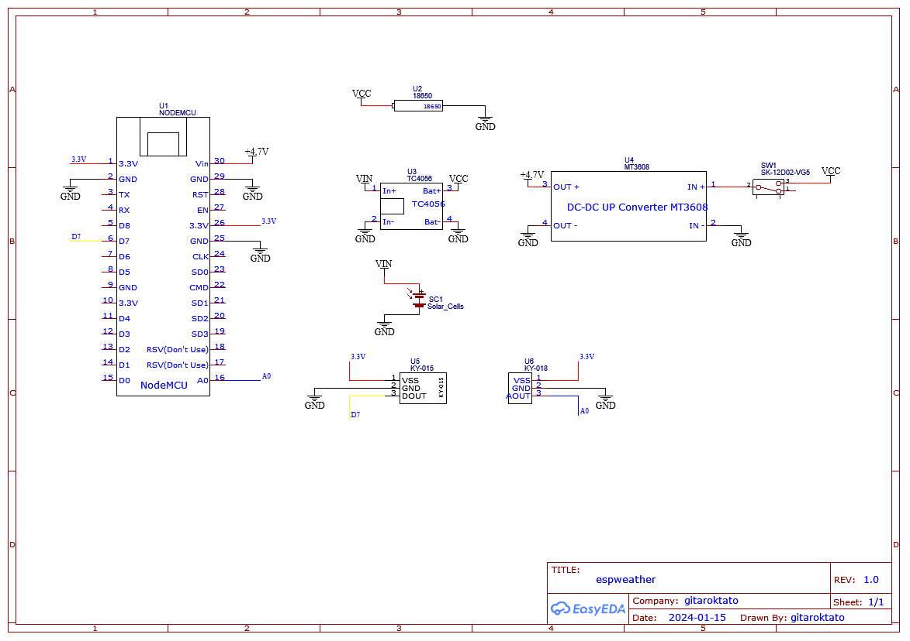
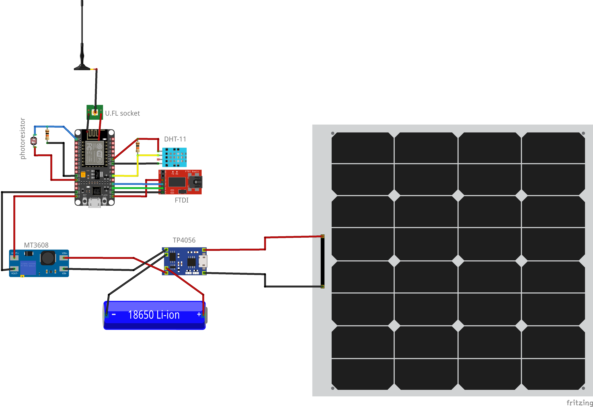
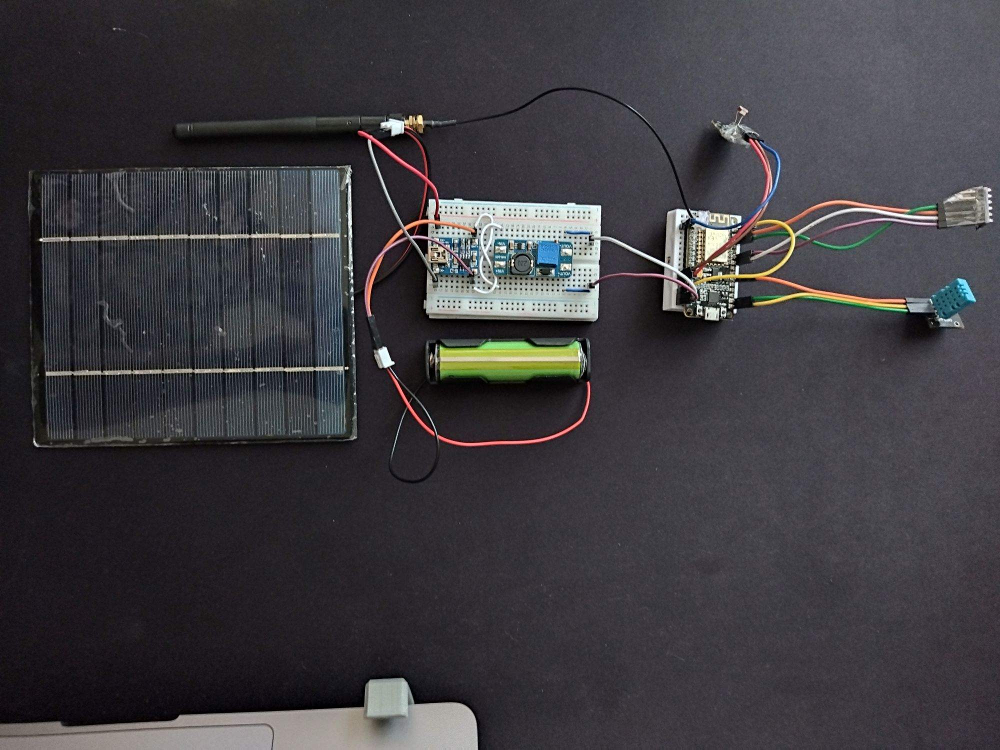
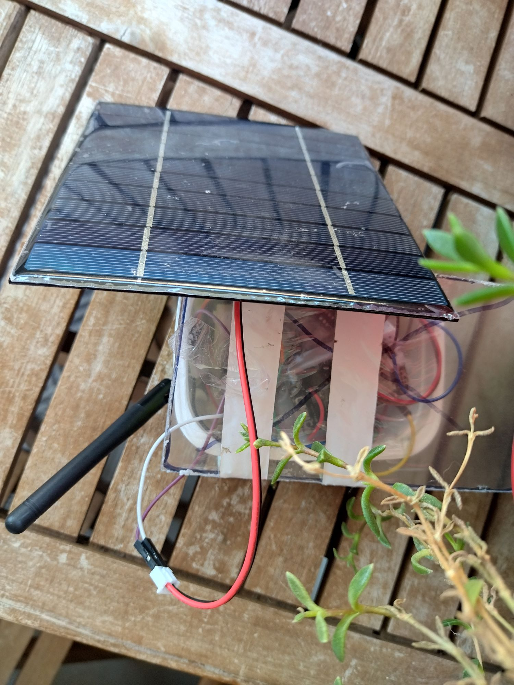
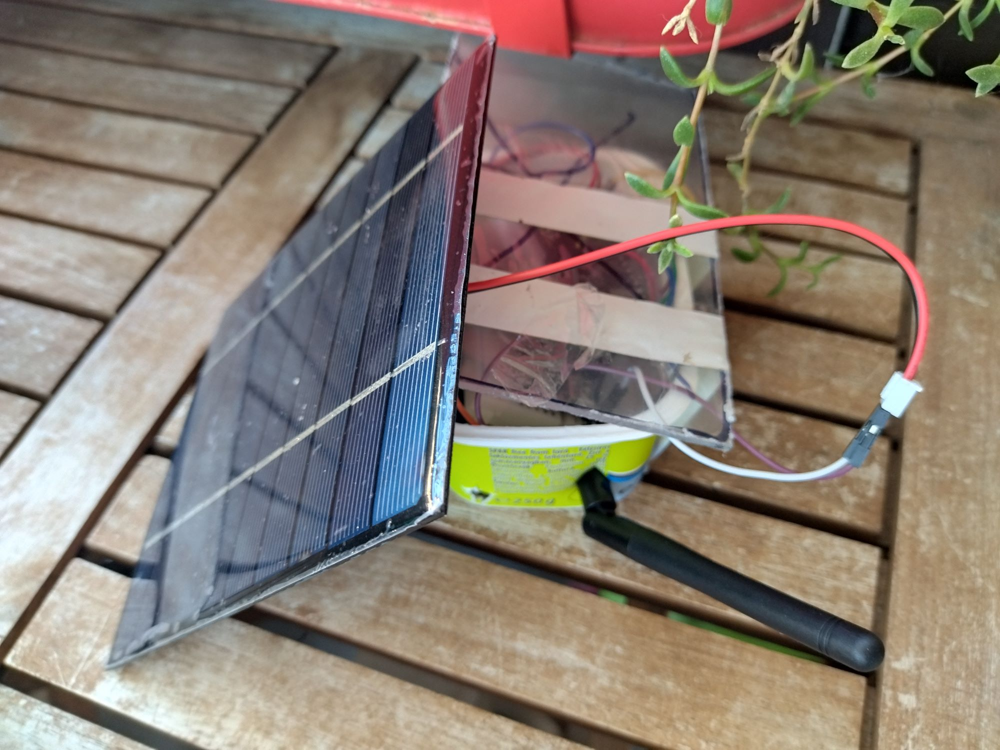
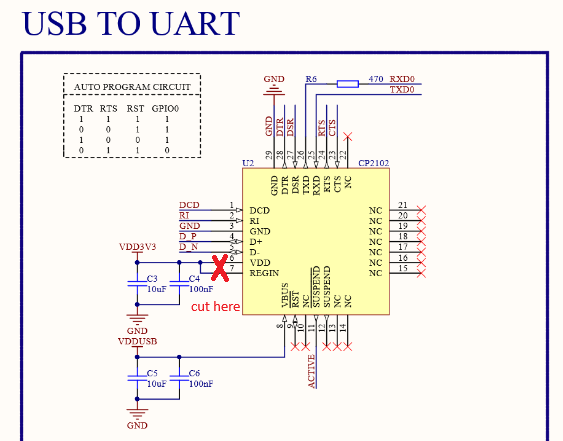
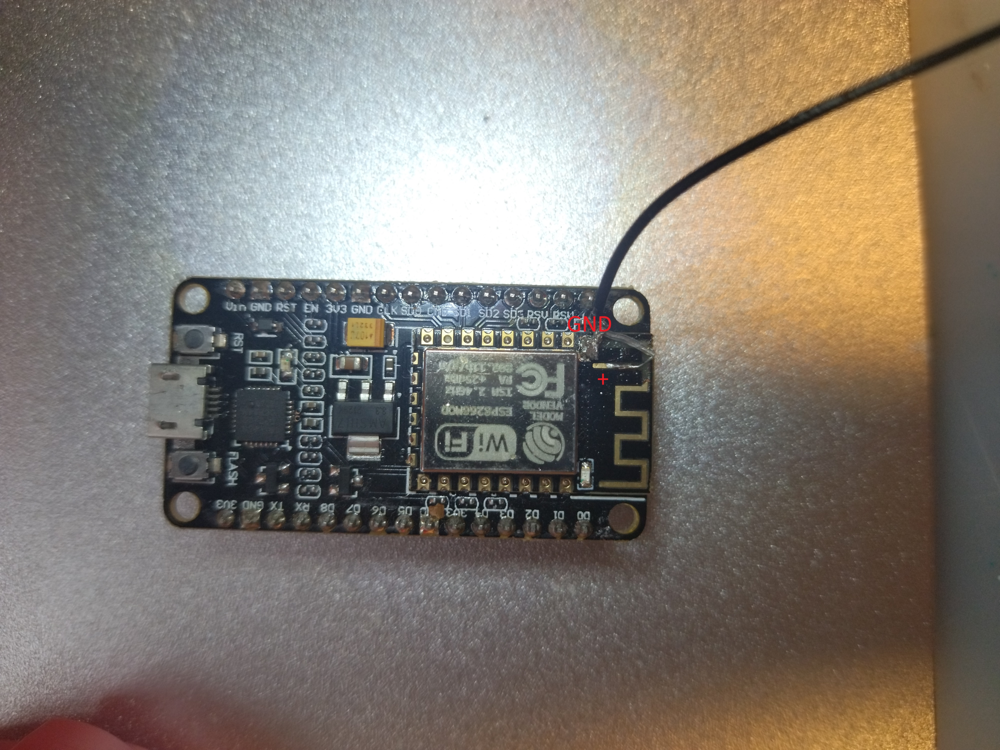
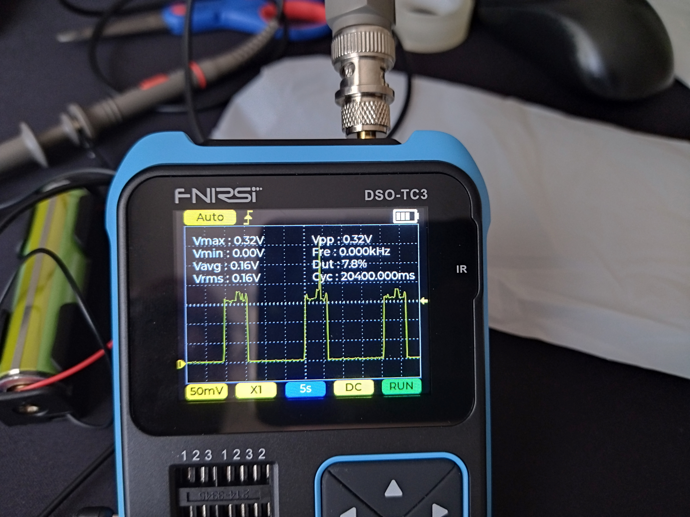

# An ESP8266 -based Weather Station

## Realtime Measurements

## Schematic
EasyEDA schematics

Fritzing diagram

## Look & Feel

## Energy Consumption and Battery Life
Powered by a [18650 battery with the capacity of 3300mAh](https://www.hestore.hu/prod_10039174.html?lang=en).

| State | Consumption | Period |
| -- | -- | -- |
| Wake - with onboard LEDs ON | 100mA | ~1s |
| Sleep - with onboard LEDs ON | 30mA | ~1s |
| Wake - with onboard LEDs OFF | 160mA | ~5s |
| Deep Sleep - with onboard LEDs OFF | 4mA | ~15 min |

### Battery life estimation
Over an hour period we expect to have 4 times `5s` spent on reporting. During these intervals the energy consumption is `160mA`.
In the remaining time we expect to consume `4mA`. This period lasts for `3600s - (4 * 5s)) = 3580s`.

The total battery consumption over an hour is around `160mA * 5s * 4` for the reporting periods, and `4mA * 3580s` for the deep sleep.
**Consumption over an hour is** `(3200mA + 14320mA) / 3600s ~= 4.86mA`

On average expected reporting time should be **28 days (3300mAh / ~4.86mA / 24h)**!

- Current reporting time without deep sleep and both LEDs blinking ~22 hrs
- Last reporting time with deep sleep ~3 days (on balcony, but suspecting continuous connection problems. See issue #12)
- Last reporting time with deep sleep ~14 days (on balcony with a step-up converter)

### Circuit Bending
#### Cutting off the onboard USB UART bridge
In order to reduce power consumption Node MCU requires hardware modifications. This is mainly due to the fact, that the CP2102 UART bridge is getting powered even if we use the 3V3 pin. The estimated power consumption is around `~15mA`. This can be done with an exacto knife.

Programming and flashing firmware for the ESP8266 can be done with an FTDI chip (see [Fritzing diagram](#schematic))

First we scrape off the resin from the surface to reveal the ciruit.

Next we break the connection.

- More about this topic is available [over here](https://tinker.yeoman.digital/2016/05/29/running-nodemcu-on-a-battery-esp8266-low-power-consumption-revisited/).
- See the schematics [over here](https://github.com/nodemcu/nodemcu-devkit-v1.0/blob/master/NODEMCU_DEVKIT_V1.0.PDF).

#### External SMA antenna
Another improvement we can do is to include an external antenna. You can solder it directly, or use an U.FL connector for nicer look & feel.

If you want to solder in an U.FL socket, you need to arrange it the following way. Start with cutting off the connection for the onbard antenna.

Arrange the U.FL socket the following way:

For the direct wire connection you can secure your work usgin hot glue. See the images below:

More about this topic is available on [YouTube](https://www.youtube.com/watch?v=RYlvXglUnGc) and on other sites, [here](https://community.home-assistant.io/t/how-to-add-an-external-antenna-to-an-esp-board/131601) and [here](https://www.hackster.io/simon-vavpotic/esp32-and-esp8266-external-antenna-f28e6b).

### Measurements
Measurements made using an oscilloscope through a shunt resistor of 1 Ohm. See the setup below:

Wake - with onboard LEDs ON shows 60mA usage on average.

Deep sleep with periodic wake times - shows `17mA` usage on average with 80mA peak. See the table above with estimated battery life.

Deep sleep after hardware modifications - shows `4mA` usage on average with 160mA peak. See the table above with estimated battery life.

## References

- https://randomnerdtutorials.com/esp8266-pinout-reference-gpios/
- https://newbiely.com/tutorials/esp8266/esp8266-dht11
- https://arduinomodules.info/ky-015-temperature-humidity-sensor-module/
- https://nothans.com/thingspeak-tutorials/esp8266/building-the-internet-of-things-with-the-esp8266-wi-fi-module-and-thingspeak
- https://github.com/nothans/thingspeak-esp-examples/blob/master/examples/RSSI_to_ThingSpeak.ino

### 3D Designs
- https://www.thingiverse.com/thing:144665
- https://www.thingiverse.com/thing:4805867
- https://www.thingiverse.com/thing:1718334
- https://www.thingiverse.com/thing:1985125

### Powering ESP8266
- https://hackaday.io/project/167731-testing-cheap-linear-li-ion-chargers-for-solar
- https://forum.arduino.cc/t/how-to-power-esp8266-ch304-with-18650-li-ion-battery/1179338/14
- https://randomnerdtutorials.com/esp8266-voltage-regulator-lipo-and-li-ion-batteries/
- https://randomnerdtutorials.com/power-esp32-esp8266-solar-panels-battery-level-monitoring/
- https://www.youtube.com/watch?v=f2yMs-JAyQM
- https://www.youtube.com/watch?v=ttyKZnVzic4
- https://youtu.be/6DY767kQnUM?si=SXygTiLH4zx0RgAH

### Power Consumption Comparison
- https://blog.voneicken.com/2018/lp-wifi-esp-comparison/

### Deep Sleep
- https://randomnerdtutorials.com/esp8266-deep-sleep-with-arduino-ide/
- https://www.instructables.com/ESP8266-Pro-Tips
- https://arduinodiy.wordpress.com/2020/01/18/very-deepsleep-and-energy-saving-on-esp8266/

### Photocells
- https://www.mouser.com/datasheet/2/737/photocells-932884.pdf

### FTDI Upload for ESP8266
- https://community.platformio.org/t/esp32-pio-unified-debugger/4541/19

### BME280
- https://randomnerdtutorials.com/esp8266-bme280-arduino-ide

